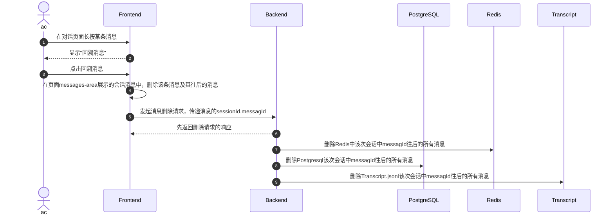

# 需求：支持用户对话消息回退

# 需求功能

该需求目的是支持用户在一次对话中，指定某一条消息，从对话内该条消息开始，将该条消息及其以后的消息从数据库/transcripts.jsonl/redis中删除。下面以一个实际例子距离，以下是某一次聊天的transcript.jsonl文件：

```jsonl
{"type":"session_created","sessionId":"2ebd2c75-a083-4e10-bbff-cdc8312d5a9c","timestamp":"2026-03-15T03:45:54.013Z"}
{"type":"message_saved","messageId":"7dff7ca4-2ab1-4329-aca5-010077f8fead","sessionId":"2ebd2c75-a083-4e10-bbff-cdc8312d5a9c","role":"user","userId":"demo-user","mentionedAgents":["codex"],"content":"@Codex 帮我推荐一些适合个人开发2D俯视角游戏的框架或者技术","contentPreview":"@Codex 帮我推荐一些适合个人开发2D俯视角游戏的框架或者技术","timestamp":"2026-03-14T19:45:54.105Z"}
{"type":"message_saved","messageId":"0eb630a7-9c1c-4ae6-b189-204b56a72881","sessionId":"2ebd2c75-a083-4e10-bbff-cdc8312d5a9c","role":"assistant","agentId":"codex-001","agentName":"Codex","mentionedAgents":[],"content":"如果你是**个人开发 2D 俯视角**，我建议按这个优先级选：\n\n1. **Godot（首推）**  \n特点：开源免费、2D 功能完整（TileMap/2D 物理/动画/导航），迭代快，特别适合独立开发。  \n适合：想快速做出完整可发布作品。  \n\n2. **GameMaker（2D 专精）**  \n特点：对 2D 非常友好，上手快，工具链成熟。  \n适合：更偏“快速出原型和成品”，不想花太多时间折腾底层。  \n\n3. **Unity 2D（生态最全）**  \n特点：资源和教程非常多，2D 工具齐全（Sprite/Tilemap/2D Physics/URP 2D）。  \n适合：后续可能扩展到更复杂系统，或你已有 C# 基础。  \n\n4. **Phaser（网页平台首选）**  \n特点：JS/TS 开发，专注 2D，发布 Web 非常方便。  \n适合：做网页游戏、小游戏平台分发。  \n- h","timestamp":"2026-03-14T19:46:51.460Z"}
{"type":"message_saved","messageId":"af106190-3965-40f5-b018-afa8857c1b86","sessionId":"2ebd2c75-a083-4e10-bbff-cdc8312d5a9c","role":"user","userId":"demo-user","mentionedAgents":["claude"],"content":"@Claude 你有什么补充吗","contentPreview":"@Claude 你有什么补充吗","timestamp":"2026-03-14T19:47:22.837Z"}
{"type":"message_saved","messageId":"483093c6-bf98-4ec0-9401-20b6c8242a07","sessionId":"2ebd2c75-a083-4e10-bbff-cdc8312d5a9c","role":"assistant","agentId":"claude-001","agentName":"Claude","mentionedAgents":[],"content":"补充几个选择：\n\n**3. Unity（2D 支持成熟）**\n- 优点：资源商店丰富、教程多、2D 工具链完善\n- 缺点：相对重，个人开发可能杀鸡用牛刀\n- 适合：未来可能转 3D 或需要大量现成资源\n\n**4. Phaser / PixiJS（Web 技术栈）**\n- 优点：如果你熟悉 JS/TS，零学习成本\n- 缺点：性能和打包不如原生引擎\n- 适合：想快速验证原型、或做网页小游戏\n\n**5. LÖVE (Lua)**\n- 优点：极简、轻量、Lua 易学\n- 缺点：生态较小，需要自己拼装更多东西\n- 适合：喜欢\"从零搭建\"的感觉\n\n---\n\n**选择建议：**\n\n","timestamp":"2026-03-14T19:47:41.920Z"}
{"type":"message_saved","messageId":"810917f5-95a2-4373-b33d-12102462cead","sessionId":"2ebd2c75-a083-4e10-bbff-cdc8312d5a9c","role":"user","userId":"demo-user","mentionedAgents":["claude"],"content":"@Claude 更进一步，有没有能够生成游戏美术素材（比如2D地图场景、像素物品块）的AI技术？","contentPreview":"@Claude 更进一步，有没有能够生成游戏美术素材（比如2D地图场景、像素物品块）的AI技术？","timestamp":"2026-03-14T20:39:29.937Z"}
{"type":"message_saved","messageId":"3b7ac2d1-eef7-451b-b796-c290529cef7d","sessionId":"2ebd2c75-a083-4e10-bbff-cdc8312d5a9c","role":"assistant","agentId":"claude-001","agentName":"Claude","mentionedAgents":[],"content":"有的，现在 AI 生成游戏美术素材已经很成熟了：\n\n## 像素风格素材\n\n**1. PixelLab / Pixelorama**\n- 专门的像素画工具，部分支持 AI 辅助\n\n**2. Midjourney + 像素提示词**\n- 用 `pixel art`, `16-bit`, `sprite sheet` 等关键词\n- 适合生成角色、物品图标\n\n**3. Stable Diffusion + 像素模型**\n- 可下载专门的像素风格 LoRA 模型\n- 本地运行，无限生成\n\n---\n\n","timestamp":"2026-03-14T20:40:02.519Z"}
{"type":"message_saved","messageId":"b4f766f9-89f5-4f2c-ac03-7144e16cd8b3","sessionId":"2ebd2c75-a083-4e10-bbff-cdc8312d5a9c","role":"user","userId":"demo-user","mentionedAgents":["codex"],"content":"@Codex 你觉得我作为没有美术基础的开发者，该怎么利用这些工具？","contentPreview":"@Codex 你觉得我作为没有美术基础的开发者，该怎么利用这些工具？","timestamp":"2026-03-14T20:41:17.439Z"}
{"type":"message_saved","messageId":"6c624a6b-7583-4122-a564-80dfbf3bcde4","sessionId":"2ebd2c75-a083-4e10-bbff-cdc8312d5a9c","role":"assistant","agentId":"codex-001","agentName":"Codex","mentionedAgents":[],"content":"你这种情况最适合走“**AI 出草图 + 你做筛选和统一**”的路线，而不是追求一次生成成品。\n\n可以按这个流程来：\n\n1. **先定风格，不要先乱出图**  \n先写一页风格说明：  \n`题材 + 视角 + 色板(5-8色) + 像素尺寸(如16x16/32x32) + 光照方向`。  \n后面所有提示词都严格复用这套设定。\n\n2. **先做可玩原型，再补美术**  \n先用纯色方块把移动、战斗、交互跑通（Godot + Tiled 很合适）。  \n玩法没定前，不要大量生成素材，避免返工。\n\n3. **AI 分工生成素材**  \n- **物品/角色小图标**：Midjourney 或 SD（像素 LoRA）  \n- **地表纹理/瓦片**：SD 批量出 tile 基底  \n- **UI 草图**：先让 AI 出布局，再自己在 Figma 微调  \n核心原则：一次只生成一类资产（例如“森林地表瓦片包”）。\n\n4. **把 AI 图“游戏化”**  \n用 Pixelorama/Aseprite 做三件事：  \n- 对齐像素网格  \n- 统一描边/阴影方向  \n- 控制颜色数量（减色）  \n这样风格会从“拼凑感”变成“同一套资源”。\n\n5. **建立你的素材生产线（最关键）**  \n目录建议：`/style_guide /prompts /raw_ai /cleaned /in_game`  \n每张图保留对应 prompt，好的就复用，不好的就迭代。  \n你会很快积累出自己的“可复用提示词库”。\n\n6. **注意版权与商用**  \n确认平台许可、模型许可、是否含训练集争议；商用前做一次来源审计。  \n避免直接用知名游戏 IP 风格关键词。\n\n","timestamp":"2026-03-14T20:41:57.414Z"}
{"type":"message_saved","messageId":"52642c63-8438-4c9f-8f7b-ae604f7da7ac","sessionId":"2ebd2c75-a083-4e10-bbff-cdc8312d5a9c","role":"user","userId":"demo-user","mentionedAgents":["claude"],"content":"@Claude 有没有生成美术资源的例子示范？","contentPreview":"@Claude 有没有生成美术资源的例子示范？","timestamp":"2026-03-14T22:08:36.069Z"}
{"type":"message_saved","messageId":"8fb20200-087f-481e-bb63-c11dc0c0dc1f","sessionId":"2ebd2c75-a083-4e10-bbff-cdc8312d5a9c","role":"assistant","agentId":"claude-001","agentName":"Claude","mentionedAgents":[],"content":"## 具体示例示范\n\n### 1. 像素角色 Sprite Sheet\n\n**Midjourney 提示词：**\n```\npixel art sprite sheet of a fantasy warrior character, \n16x16 pixels each frame, 4-direction walk animation, \ntop-down view, 16-bit style, limited color palette, \ngame asset, transparent background --v 6\n```\n\n**Stable Diffusion + LoRA：**\n- 安装 `pixel-art-v2` LoRA 模型\n- 提示词：`<lora:pixel-art:1> RPG hero sprite, 32x32, 4 frame walk cycle, top down`\n\n---\n\n### 2. 瓦片/Tile 素材\n\n**地表瓦片（草地/石板）：**\n```\nseamless grass tile, pixel art, 16x16, top down game tile,\nbright green, simple style, game asset --no characters\n```\n\n**墙壁瓦片：**\n```\ndungeon stone wall tile, pixel art, 16x16, seamless,\ndark fantasy style, top down RPG tileset\n```\n\n---\n\n### 3. 物品图标\n\n**药水瓶：**\n```\npixel art potion bottle icon, red healing potion,\n16x16, item icon, RPG game asset, white background\n```\n\n**宝箱：**\n```\npixel art treasure chest, 32x32, top down view,\nRPG item, closed and open versions, game sprite\n```\n\n---\n\n","timestamp":"2026-03-14T22:09:10.574Z"}
```

用户会指定**自己发送的消息**，选择“回溯消息”，比如用户制定了messageId=="52642c63-8438-4c9f-8f7b-ae604f7da7ac"的消息，那么该条消息及其后续的消息"8fb20200-087f-481e-bb63-c11dc0c0dc1f"，都需要从**前端**删除不再展示、**后端数据库/transcripts.jsonl/redis**删除。

# 需求流程



该功能的流程主要如上图所示：

1、用户在前端点击messages-area内展示的某条消息；

2、前端在用户点击的消息旁边展示一个小悬浮框（不影响其他元素交互，点击悬浮框以外的位置，悬浮框消失），悬浮框内提供“回溯消息”按钮；

3、用户点击“回溯消息”，前端从messages-area中把该条消息及以后的消息删除，并且不再展示；

4、前端发送请求到后端，携带sessionId以及messageId，messageId即为用户选择回溯的消息id；

5、后端接收到请求，返回OK给前端，同时异步处理删除消息的流程：

- 首先删除redis的记录，删除该sessionId对应对话历史中messageId往后的所有消息；
- 然后删除Postgresql的记录，删除该sessionId对应对话历史中messageId往后的所有消息；
- 最后删除workspace目录下Transcript.jsonl对应的消息，删除该sessionId对应对话历史中messageId往后的所有消息；

## 约束

1. 前端只需要对message.role === 'user'的消息提供“回溯消息”的功能；

# 可靠性设计

1. 后端接收到“回溯消息”的请求后，需要**异步**删除后端**数据库/transcripts.jsonl/redis**保存的数据，三个数据保存的源都需保证成功，因此该删除操作需要保证**原子性**。关键实现有日志。
2. 当前后端数据库中messages表的消息无顺序之分，思考：该如何删除messageId后接的所有消息。是在业务侧保证，还是新加一个字段表示顺序含义，还是复用createAt字段？


